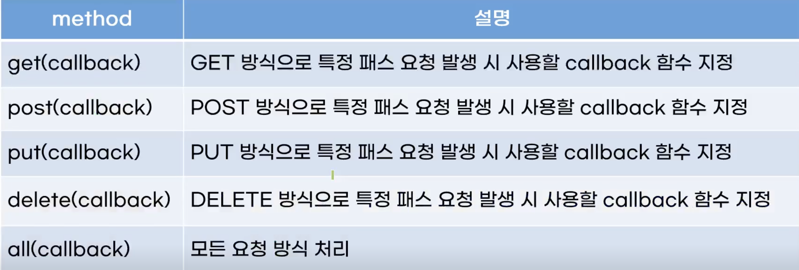

### 라우터 사용하기

**라우터 미들웨어**

- 요청 url을 일일이 확인하는 문제 해결
- 사용자가 요청한 기능을 path 기준으로 구별
- 라우터 객체 참조
  - const router = express.Router();
- 라우팅 함수 등록
  - router.route('/process/login').get(...);
  - router.route('/process/login').post(...);
  - router.route(요청 path).get/post(실행될 함수);
- app 객체에 등록
  - app.use('/', router);

- 요청 path를 라우터 객체에 등록할 때 사용하는 메소드
